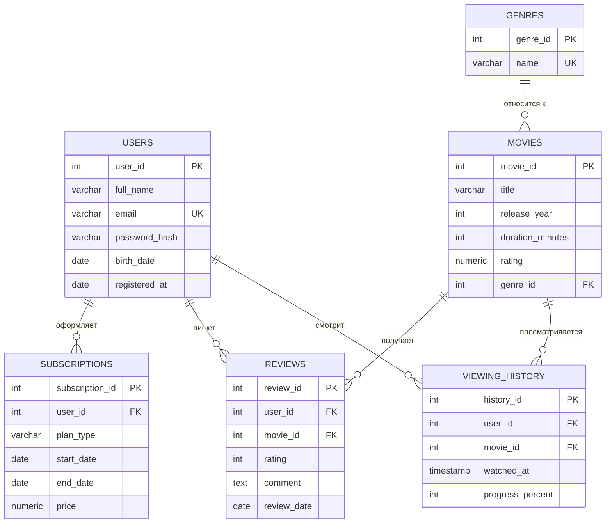

# Лабораторная работа №1. Проектирование и реализация реляционной БД

Вариант 4: **Онлайн-кинотеатр**

## 1. Описание предметной области

Сервис онлайн-кинотеатра, в котором пользователи регистрируются, оформляют подписки,
смотрят фильмы, оставляют отзывы и накапливают историю просмотров. Фильмы разбиты по жанрам.

## 2. Сущности и атрибуты

- **users** — пользователи сервиса (ФИО, email, пароль, дата рождения, дата регистрации).
- **genres** — жанры фильмов (название).
- **movies** — фильмы (название, год выпуска, длительность, рейтинг, жанр).
- **subscriptions** — подписки пользователей (тип тарифа, период действия, цена).
- **reviews** — отзывы пользователей на фильмы (оценка, комментарий, дата).
- **viewing_history** — история просмотров (какой пользователь, какой фильм, процент просмотра).

## 3. Связи

- один пользователь — много подписок (1:N)
- один пользователь — много отзывов (1:N)
- один пользователь — много записей истории просмотров (1:N)
- один фильм — много отзывов (1:N)
- один фильм — много записей истории просмотров (1:N)
- один жанр — много фильмов (1:N)

## 4. ER-диаграмма

Диаграмма в формате Mermaid находится в файле `ER_diagram.mmd`
(открывается в VSCode, GitHub или на сайте mermaid.live).



## 5. Обоснование приведения к 3НФ

- **1НФ**: все атрибуты атомарны (нет списков, нет повторяющихся групп в одной ячейке).
- **2НФ**: у каждой таблицы простой первичный ключ (кроме составного UNIQUE в `reviews`,
  который не является первичным ключом), поэтому частичной зависимости от части ключа
  не возникает.
- **3НФ**: нет транзитивных зависимостей — например, `rating` фильма не зависит от
  `genre_id`, а `price` подписки не выводится из `plan_type` через другой неключевой
  атрибут. Каждый неключевой атрибут зависит только от первичного ключа своей таблицы.

## 6. Основные проектные решения

- `genres` вынесены в отдельную таблицу, чтобы не дублировать названия жанров в `movies`.
- В `reviews` добавлено составное ограничение `UNIQUE (user_id, movie_id)` — один
  пользователь может оставить только один отзыв на фильм.
- В `subscriptions` добавлено составное ограничение `CHECK (end_date > start_date)`,
  использующее сразу два столбца.
- `ON DELETE CASCADE` используется там, где дочерние записи (подписки, отзывы, история)
  теряют смысл без пользователя или фильма.
- `ON DELETE RESTRICT` используется для `movies.genre_id`, чтобы нельзя было случайно
  удалить жанр, пока к нему привязаны фильмы.

## 7. Ограничения целостности

| Тип | Где |
|---|---|
| UNIQUE | `users.email`, `genres.name` |
| Составное UNIQUE | `reviews (user_id, movie_id)` |
| CHECK | `movies.release_year`, `movies.duration_minutes`, `movies.rating`, `subscriptions.plan_type`, `subscriptions.price`, `reviews.rating`, `viewing_history.progress_percent` |
| Составное CHECK | `subscriptions (end_date > start_date)` |
| NOT NULL | все обязательные атрибуты (email, пароль, название фильма и т.д.) |

## 8. Файлы проекта

- `schema.sql` — создание структуры БД.
- `data.sql` — тестовые данные.
- `constraints_test.sql` — некорректные операции, которые должны быть отклонены.
- `ER_diagram.mmd` — ER-диаграмма.

## 9. Порядок запуска

```bash
psql -U postgres -d cinema_db -f schema.sql
psql -U postgres -d cinema_db -f data.sql
psql -U postgres -d cinema_db -f constraints_test.sql
```
